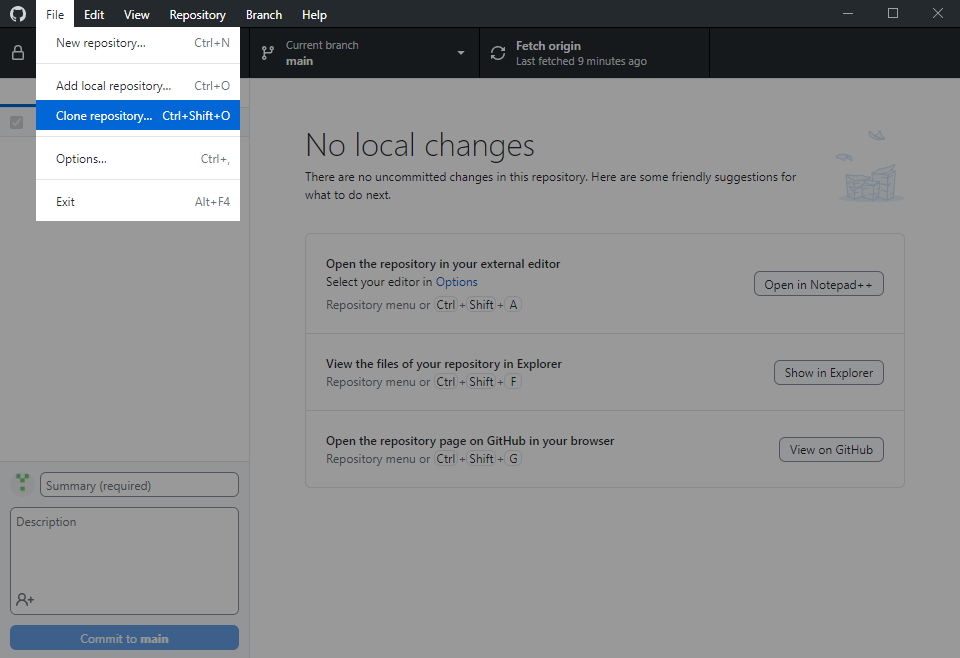
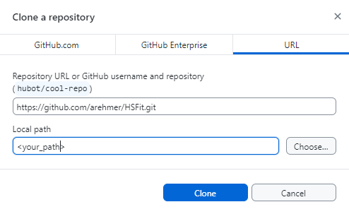

# Installation

The library was developed using the Anaconda3 distribution of Python 3.11.5. In the following instructions for the installation via conda as well as pip are provided.

## Prerequisites
- A working Pyhon installation. ([Download Python](https://www.python.org/downloads/))
- A working GitHub installation. ([Download GitHub Desktop](https://desktop.github.com/download/))
- [ArraySoft v2.30](https://cdn.website-editor.net/s/156d2965ff764637aaea150903bb0161/files/uploaded/SetupHTPAdGUIv2_30.rar?Expires=1709501376&Signature=p8nizQ9W1PC3O4uuuEpsxpqhTZc3t1vdlI1HImzhGcxrSur-9jmvYcf7EvJvU223HmZKhFJvr4dYW8PYtFwv1RVGjh626sN0ZQRICL6MBwOhqmevGODlUCFYjuGCMGWwlJCMpVz68dIYcBKjBS7MhEGKL~wCf1atkW82yr6eewPK3AJQmV0StLWQCi7Z4Q8epYWjGt4Xmuaa7wAcQJfFCBK1IKutkl52FPint4CqYarqQKfqpKJMn13SlVQSdp-RZbKZirddGrQkzTpYfi2BOuxThTn6C-FfXGQLC~Hnt1858gv96EKq23VJEGDmV~97rhQmj2YzXGySGpMnVv5xJQ__&Key-Pair-Id=K2NXBXLF010TJW) (if .bds or .txt files are to be parsed to pandas)

## Optional: Create a virtual environment
  A virtual environment is created on top of an existing Python installation, known as the virtual environment’s 'base'”' Python, and may optionally be isolated from the packages in the base environment, so only those explicitly installed in the virtual environment are available.
  A virtual environment is used to contain a specific Python interpreter and software libraries and binaries which are needed to support a project.

  A virtual environment can be created using `venv`. For example
    ```sh
    python -m venv /path/to/new/virtual/environment/hs
    ```
  will create a virtual environment called `hs` in the specified path. The environment can be activated by typing
    ```sh
      ./path/to/new/virtual/environment/hs/Scripts/activate
    ```

## Download HSPyTools
1. Clone this repository either via using the shell
   ```sh
   git clone https://github.com/arehmer/HSPyTools.git
    ```
   or using the GitHub Desktop-App: ```File-->Clone repository ``` <br>
   

   and then enter the URL ```https://github.com/arehmer/HSFit.git``` into the mask <br>
   

## Install HSPyTools
1. Open a Shell.
2. Optional: Activate the environment in which HSPyTools is to be installed via
    ```sh
    source /path/to/virtual/environment/Scripts/activate
    ```
4. Install HSFit in development mode with pip via
    ```sh
    pip install -e \path\to\HSFit>
    ```
    The installation in devlopment mode makes sure, that changes to the repository are automatically reflected in the installed library. Therefore no new installation is necessary after pulling new commits.

## Check installation
1. In the shell start the python interpreter via
   ```sh
   python
   ```
2. Then try to import HSPyTools by typing
   ```sh
   import hspytools
   ```
   If no error message occurs, installation was successful.
