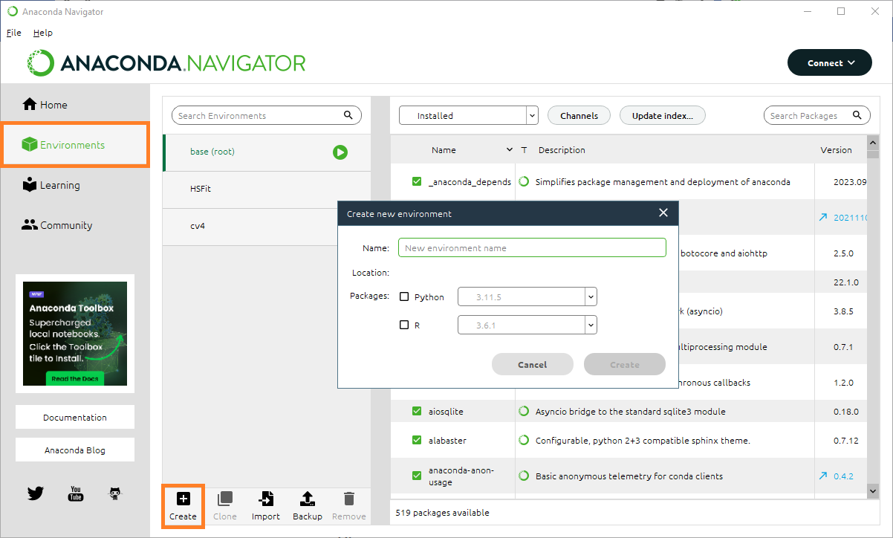
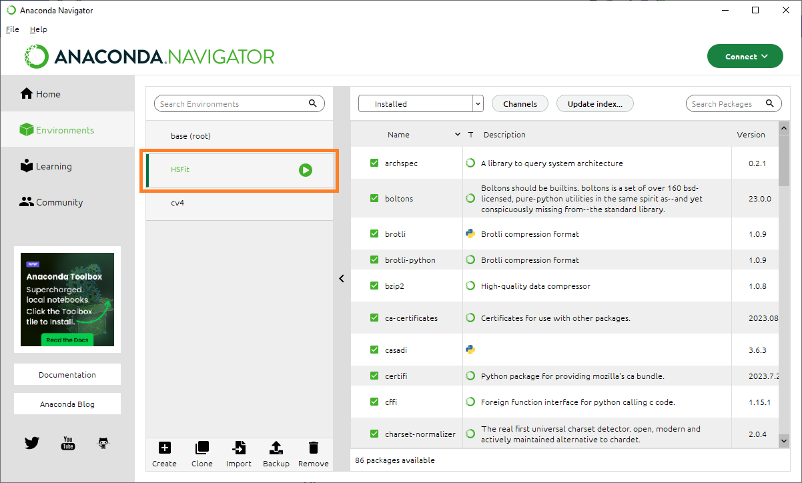
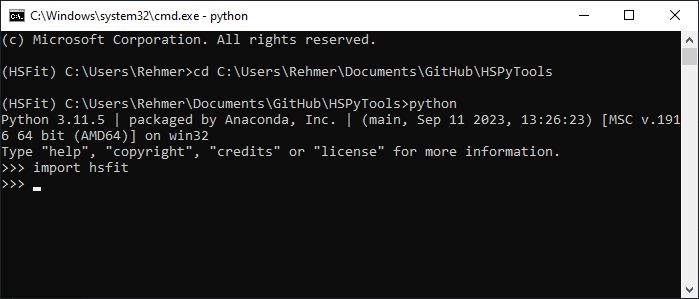

# Installation

The library was developed using the Anaconda3 distribution of Python 3.11.5. In the following instructions for the installation via conda as well as pip are provided.

## Prerequisites
- A working GitHub installation.

## Download HSPyTools

1. Clone this repository either via using the shell
   ```sh
   git clone https://github.com/arehmer/HSFit.git
    ```
   or using the GitHub Desktop-App: ```File-->Clone repository ``` <br>
   

   and then enter the URL ```https://github.com/arehmer/HSFit.git``` into the mask <br>
   
  
   
## Install Anaconda
1. Download and install the latest Anaconda distribution. [https://www.anaconda.com/](https://www.anaconda.com/)
2. After installation, open the Anaconda Navigator.
2. Create a new environment. This can be done bei either opening a conda shell in the anaconda navigator


   


   and typing 
   ```sh
   conda env create -n <name_of_environment> python=<version>
   ```
   Alternatively the GUI of the Anaconda Navigator can be used to create a new environment. 


   

In this documentation the created environment was named "HSFit".

## Install HSPyTools
1. Activate the created environment by clicking on it in the "Environments" tab.


   


2. Go back to the "Home" tab and open a conda shell.
3. Change to the directory where the HSPyTools repository is located. In that folder a file setup.py should be located
   ```sh
   cd <C:\..\..\HSPyTools>
   ```
4. Install HSPyTools in development mode by typing
   ```sh
   pip install -e .
   ```

If pip is not installed in the environment yet, install it first via
```sh
conda install pip
```


## Check installation
1. In the conda shell type
   ```sh
   python
   ```
2. Then try to import HSPyTools by typing
   ```sh
   import hspytools
   ```


   